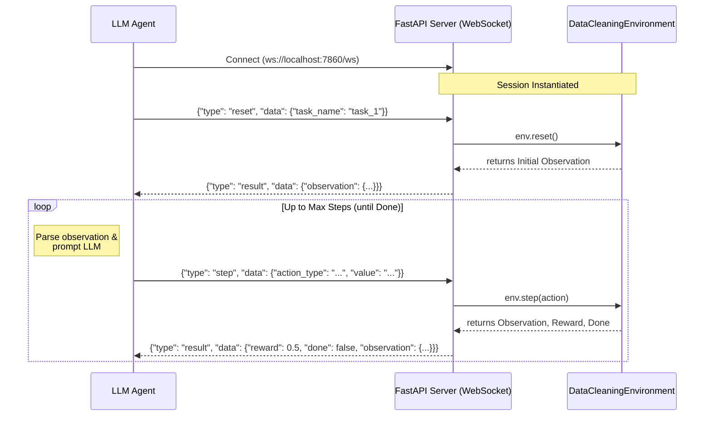

# 🧹 Data Cleaning Environment — OpenEnv

A real-world **OpenEnv environment** for training and evaluating AI agents on **data quality assessment**. Agents analyze datasets with planted errors and must identify, classify, and fix data quality issues — one of the most time-consuming tasks in data science.

---

## 🎯 Why Data Cleaning?

Data scientists spend **60–80% of their time** cleaning and preparing data ([Forbes](https://www.forbes.com/sites/gilpress/2016/03/23/data-preparation-most-time-consuming-least-enjoyable-data-science-task-survey-says/)). This environment models that exact workflow:

- **Realistic**: Uses customer subscription records with genuine error patterns (missing values, format issues, outliers, duplicates, type errors, inconsistencies)
- **High utility**: Directly trains agents for a task with massive real-world demand
- **Deterministic grading**: Every error has a known ground truth — scores are reproducible

---

## 📊 Dataset

A synthetic **Customer Subscription Records** dataset with 15 rows and 9 columns:

| Column | Type | Validation Rules |
|--------|------|-----------------|
| `id` | int | Unique, sequential |
| `name` | str | "First Last" format |
| `email` | str | Valid email format with TLD |
| `age` | int | 18–100 |
| `city` | str | Valid US city |
| `signup_date` | str | YYYY-MM-DD, valid date |
| `plan` | str | free, basic, premium, enterprise |
| `monthly_amount` | float | Must match plan pricing |
| `status` | str | active, inactive, suspended, cancelled |

**10 intentionally planted errors** across 6 error types:
- `missing_value` — Empty cells where data is expected
- `invalid_format` — Wrong format (bad email, impossible date, typo)
- `outlier` — Statistically impossible values (negative age, age=250)
- `duplicate` — Exact duplicate of another row
- `type_error` — Wrong data type (word string instead of integer)
- `inconsistency` — Values contradict each other (plan vs. pricing)

---

## 🎮 Tasks

### Task 1: Error Identification (Easy)
**Objective**: Find which rows contain errors  
**Agent sends**: `{"row_ids": [2, 3, 5, ...]}`  
**Grading**: F1 score comparing predicted vs. actual error rows  
**Expected baseline**: ~70–80%

### Task 2: Error Classification (Medium)
**Objective**: Find errors AND classify their type  
**Agent sends**: `{"errors": [{"row_id": 2, "column": "email", "error_type": "invalid_format"}, ...]}`  
**Grading**: 50% location accuracy + 50% type accuracy  
**Expected baseline**: ~50–60%

### Task 3: Error Correction (Hard)
**Objective**: Find, classify, AND fix every error  
**Agent sends**: `{"fixes": [{"row_id": 2, "column": "email", "error_type": "invalid_format", "current_value": "bob.smith@yahoo", "corrected_value": "bob.smith@yahoo.com"}, ...]}`  
**Grading**: 30% location + 30% type + 40% fix quality  
**Expected baseline**: ~30–40%

---

## 🔁 Reward Design

Rewards provide **partial progress signals** (not just binary end-of-episode):

| Signal | Reward |
|--------|--------|
| Correct error identification | Proportional to F1 |
| Correct error location | +location_score |
| Correct error type | +type_score |
| Correct fix value | +fix_score |
| Invalid JSON format | -0.05 |
| False positives | -0.02 each (max -0.10) |

Agents get **feedback** after each step with hints about what they got right/wrong, allowing iterative refinement within an episode.

---

## 🏗 Architecture

### Agent ↔ Environment Interaction Flow



### Directory Structure

```
openenv-data-cleaning/
├── server/
│   ├── app.py              # FastAPI server (HTTP + WebSocket)
│   ├── environment.py      # Core environment logic
│   ├── __init__.py
│   └── Dockerfile
├── models.py               # Action, Observation, State dataclasses
├── data.py                 # Synthetic dataset with planted errors
├── client.py               # EnvClient (async + sync)
├── openenv.yaml            # Environment manifest
├── pyproject.toml           # Package config
├── requirements.txt
├── inference.py            # Baseline inference script
└── README.md
```

---

## 🚀 Setup & Usage

### Prerequisites
- Python 3.10+
- Docker (for container deployment)

### Local Development

```bash
# Install dependencies
pip install -r requirements.txt

# Run the server (use port 7860 to match HF Spaces)
uvicorn server.app:app --host 0.0.0.0 --port 7860 --reload
```

### Docker

```bash
# Build
docker build -t data-cleaning-env:latest .

# Run
docker run -d -p 7860:7860 data-cleaning-env:latest

# Health check
curl http://localhost:7860/health
```

### Run Baseline Inference

```bash
# First, start the environment server (Docker or local)
docker run -d -p 7860:7860 data-cleaning-env:latest

# Then run inference
export API_BASE_URL="https://router.huggingface.co/v1"
export MODEL_NAME="meta-llama/Llama-3.3-70B-Instruct"
export HF_TOKEN="your_token_here"
export ENV_URL="http://localhost:7860"

python inference.py
```

---

## 🔌 API Endpoints

| Endpoint | Method | Description |
|----------|--------|-------------|
| `/health` | GET | Health check |
| `/info` | GET | Environment metadata |
| `/reset` | POST | Reset environment (stateless) |
| `/ws` | WebSocket | Stateful multi-step sessions |
| `/web` | GET | Simple web UI |
| `/docs` | GET | OpenAPI spec (auto-generated) |

### WebSocket Protocol

```json
// Client → Server
{"type": "reset", "data": {"task_name": "task_1_identify"}}
{"type": "step", "data": {"action_type": "identify_errors", "value": "{\"row_ids\": [2,3]}"}}
{"type": "state", "data": {}}
{"type": "close", "data": {}}

// Server → Client
{"type": "result", "data": {"observation": {...}, "reward": 0.8, "done": false}}
{"type": "state", "data": {"episode_id": "abc123", "step_count": 2, ...}}
{"type": "error", "data": {"message": "...", "code": "..."}}
```

---

## 📈 Baseline Scores

| Task | Score | Description |
|------|-------|-------------|
| task_1_identify | **1.000** | LLM perfectly identifies all error rows |
| task_2_classify | **0.980** | LLM classifies nearly all errors correctly |
| task_3_fix | **0.700** | LLM fixes most errors but struggles with some corrections |
| **Average** | **0.893** | Strong baseline across all tasks |

*Scores measured with `meta-llama/Llama-3.3-70B-Instruct` via HF Inference API*

---

## 📋 License

BSD-3-Clause — see [LICENSE](LICENSE) file.

---

## 🏆 OpenEnv Phackathon

This environment was built for the [Meta PyTorch × Hugging Face OpenEnv Phackathon](https://github.com/meta-pytorch/OpenEnv) Round 1.

**Tags**: `openenv`, `data-cleaning`, `data-quality`, `ai-agent`
